# Guida di BIMit

BIMit assegna la **WBS** agli elementi dei modelli Autodesk Revit (2023, 2024, 2025, 2026) ed
esporta tavole e viste in PDF, DWG, NWC e IFC.
Questa guida mostra ogni finestra e spiega ogni pulsante, nell'ordine in cui li usi.

> Le immagini sono fatte sul modello di esempio di Autodesk *Snowdon Towers Sample HVAC*. Nel tuo
> Revit i nomi delle categorie compaiono nella lingua di Revit (per esempio *Terminali d'aria*
> invece di *Air Terminals*).

## Indice

1. [Installare, aggiornare, disinstallare](#1-installare-aggiornare-disinstallare)
2. [Account: accesso e registrazione](#2-account-accesso-e-registrazione)
3. [La scheda BIMit in Revit](#3-la-scheda-bimit-in-revit)
4. [L'intestazione delle finestre](#4-lintestazione-delle-finestre)
5. [La finestra WBS](#5-la-finestra-wbs)
6. [Configurare i parametri](#6-configurare-i-parametri)
7. [Gli stati: completo, da rivedere, incompleto](#7-gli-stati-completo-da-rivedere-incompleto)
8. [Anteprima](#8-anteprima)
9. [Scrivi nel modello](#9-scrivi-nel-modello)
10. [Il dizionario Excel](#10-il-dizionario-excel)
11. [Esporta tavole e viste](#11-esporta-tavole-e-viste)
12. [Account, Feedback, Aggiornamento](#12-account-feedback-aggiornamento)
13. [Domande frequenti](#13-domande-frequenti)

**Il flusso in breve:** apri *WBS* → scegli *WBS normativa* (o *Manuale*) → controlla le categorie →
correggi quello che serve in *Configura* → *Anteprima* → *Scrivi nel modello*.

---

## 1. Installare, aggiornare, disinstallare

**Installare**

1. Chiudi Revit.
2. Scarica `BIMit_Setup_<versione>.msi` dall'ultima [release](../../releases/latest).
3. Aprilo con doppio clic. **Non servono permessi di amministratore**: BIMit si installa solo per il
   tuo utente, in tutte le versioni di Revit 2023–2026 presenti sul PC.
4. Apri Revit: trovi la scheda **BIMit**.

Se Windows mostra l'avviso SmartScreen: *Ulteriori informazioni* → *Esegui comunque*.

**Aggiornare** — non devi fare niente. All'avvio di Revit BIMit controlla se c'è una nuova versione,
la scarica da solo e la installa **quando chiudi Revit**, senza finestre e senza permessi di
amministratore. La volta dopo, al primo comando, un messaggio ti dice *BIMit è stato aggiornato* e
cosa è cambiato. Nuovi pulsanti e funzioni arrivano così, da soli.

Alcuni aggiornamenti sono **obbligatori**: BIMit te lo dice al primo comando e, se serve, ti fa
scaricare la nuova versione con un clic. I comandi ripartono dopo che hai chiuso e riaperto Revit.

**Disinstallare** — *Impostazioni di Windows* → *App* → *App installate* → **BIMit** →
*Disinstalla*. I parametri già scritti nei modelli restano.

---

## 2. Account: accesso e registrazione

Per usare BIMit serve un account personale (gratuito durante la beta). La finestra compare da sola
la prima volta che usi un comando, oppure con il pulsante **Account** della scheda BIMit.

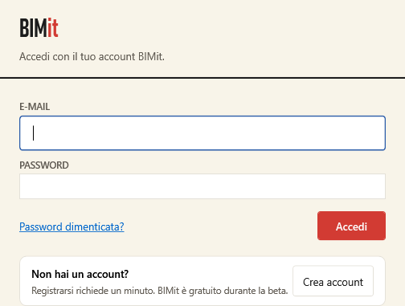

| Elemento | Cosa fa |
|---|---|
| **E-MAIL**, **PASSWORD** | Le credenziali del tuo account BIMit. |
| **Password dimenticata?** | Ti manda un'e-mail per sceglierne una nuova. Scrivi prima l'e-mail nel campo sopra. |
| **Accedi** | Entra. L'accesso resta valido anche offline fino a 30 giorni. |
| **Crea account** | Apre il modulo di registrazione (sotto). |

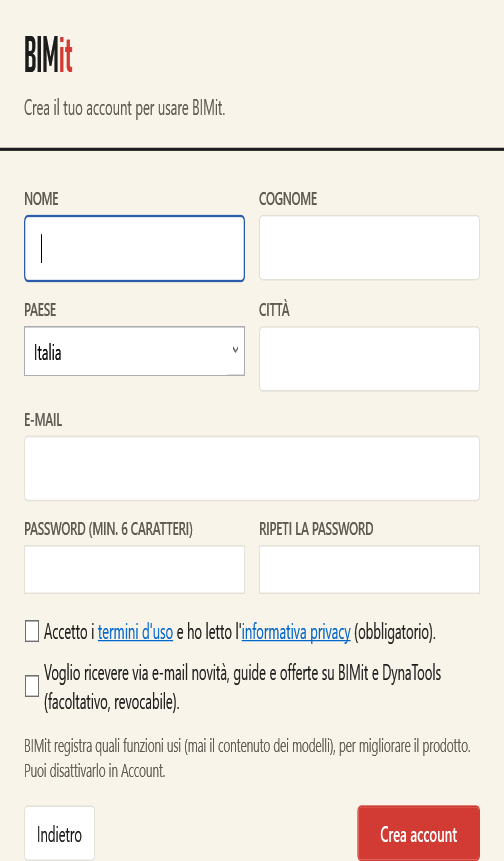

| Campo | Note |
|---|---|
| **NOME**, **COGNOME**, **PAESE**, **CITTÀ** | Obbligatori. |
| **E-MAIL** | Sarà il tuo nome utente. |
| **PASSWORD (MIN. 6 CARATTERI)**, **RIPETI LA PASSWORD** | Devono coincidere. |
| **Accetto i termini d'uso e ho letto l'informativa privacy** | Obbligatorio. I link aprono i testi. |
| **Voglio ricevere via e-mail novità…** | Facoltativo; lo cambi quando vuoi in *Account*. |
| **Indietro** | Torna all'accesso. |
| **Crea account** | Crea l'account ed entra. |

Se hai già un account ma manca il profilo, BIMit ti chiede solo i dati mancanti (pulsante **Continua**).

---

## 3. La scheda BIMit in Revit

| Pulsante | Cosa fa |
|---|---|
|  **WBS** | Apre la [finestra WBS](#5-la-finestra-wbs): configurazione, anteprima, scrittura. |
|  **Anteprima** | Apre subito l'[anteprima](#8-anteprima) con la configurazione collegata al modello. **Shift + clic**: solo gli elementi della vista attiva. |
|  **Esporta** | Tavole e viste in PDF, DWG, NWC e IFC ([Esporta](#11-esporta-tavole-e-viste)). |
|  **Account** | Accesso, profilo, privacy, aggiornamenti ([Account](#account)). |

*Anteprima* funziona solo dopo che hai salvato una configurazione per il modello dalla finestra WBS.

---

## 4. L'intestazione delle finestre

In alto in ogni finestra:

| Elemento | Cosa fa |
|---|---|
| **BIMit · titolo** | Il nome della finestra; sotto, il modello o la configurazione. Il pallino **•** dopo il nome vuol dire *modifiche non salvate*. |
| **v0.5.0** | La versione installata. |
| **Aggiorna a … / Aggiornamento pronto** | Compare solo quando c'è una nuova versione. *Aggiornamento pronto*: è già scaricata e si installa quando chiudi Revit. Apre la finestra [Aggiornamento](#aggiornamento). |
| **Guida** | Apre questa guida. |
| **Feedback** | Scrivi un problema o un'idea ([Feedback](#feedback)). |
| **BETA** | Il tuo piano. *ACCEDI* se non hai fatto l'accesso. |
| **Cerchio con le iniziali** | Apre l'*Account* (o l'accesso). |

---

## 5. La finestra WBS

La finestra principale. Si apre con il pulsante **WBS**.

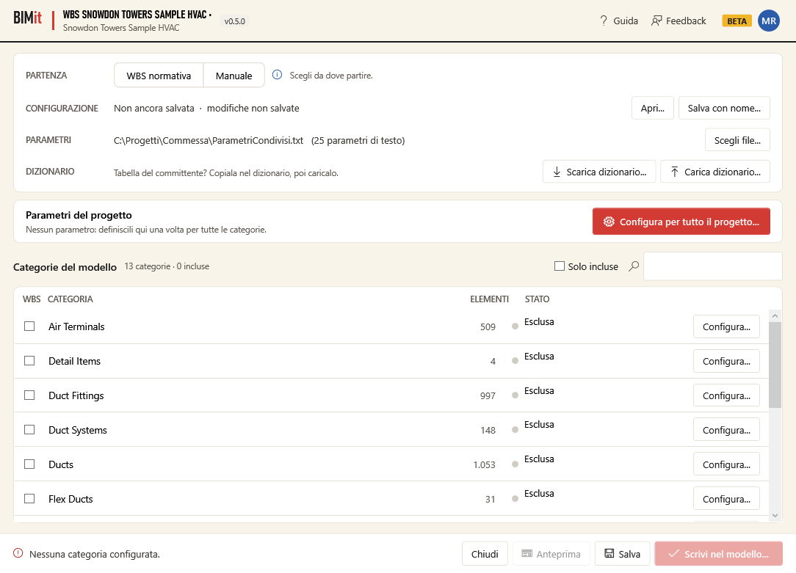

### Riquadro in alto

| Riga / pulsante | Cosa fa |
|---|---|
| **PARTENZA · WBS normativa** | Carica la WBS normativa già pronta: parametri, codici, regole e categorie. Il codice ha la forma `PROGETTO-ZONA-LIVELLO-DISCIPLINA-SISTEMA-ELEMENTO`. Poi cambi solo quello che serve. |
| **PARTENZA · Manuale** | Parti da zero e definisci tu i parametri. Svuota la configurazione attuale (BIMit chiede conferma). |
| **ⓘ** | Passa il mouse: la norma di riferimento e una spiegazione della WBS normativa. |
| **CONFIGURAZIONE** | Il file della configurazione (`.json`) e se ci sono *modifiche non salvate*. BIMit lo collega al modello: la prossima volta si riapre da solo. |
| **Apri…** | Apre un'altra configurazione, per esempio quella di un collega o di un altro progetto. |
| **Salva con nome…** | Salva la configurazione in un nuovo file. |
| **PARAMETRI** | Il file dei parametri condivisi (`.txt`) da cui scegli i nomi dei parametri. BIMit lo **legge soltanto**. Senza file, i parametri nuovi li crea BIMit con un suo file. |
| **Scegli file…** | Sceglie il file dei parametri condivisi. |
| **DIZIONARIO · Scarica dizionario…** | Salva la WBS in un foglio Excel da compilare con i codici del committente ([dizionario](#10-il-dizionario-excel)). |
| **DIZIONARIO · Carica dizionario…** | Legge il foglio compilato e aggiorna codici e struttura. |

Con la **WBS normativa** la finestra si riempie:

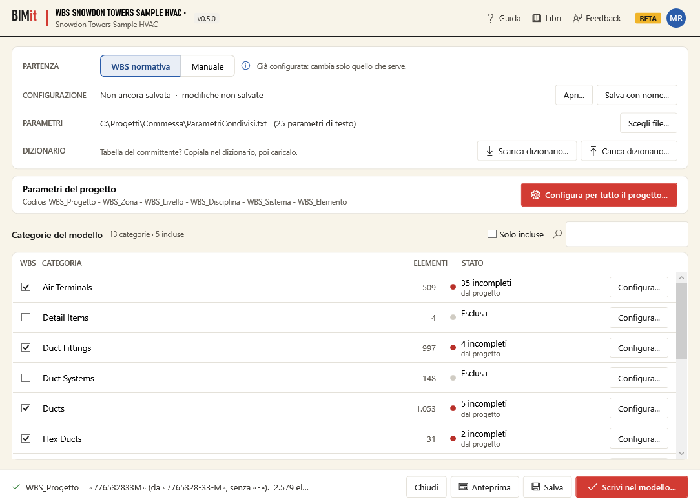

### Parametri del progetto

La riga *Codice: WBS_Progetto - WBS_Zona - …* riassume come si forma il codice.
**Configura per tutto il progetto…** apre la [configurazione dei parametri](#6-configurare-i-parametri)
che valgono per **tutte** le categorie incluse: li definisci una volta sola.

> Se il numero di progetto contiene il separatore del codice (per esempio `7765328-33-M` con `-`),
> caricando la WBS normativa BIMit lo usa senza separatore (`776532833M`) come testo fisso e te lo
> scrive in basso. Puoi cambiarlo in *Configura per tutto il progetto* → `WBS_Progetto`.

### Categorie del modello

Tutte le categorie che hanno elementi nel modello, con quanti sono.

| Colonna / pulsante | Cosa fa |
|---|---|
| **WBS** (casella) | Includi o escludi la categoria. Solo le categorie incluse ricevono la WBS. |
| **CATEGORIA**, **ELEMENTI** | Nome (nella lingua di Revit) e numero di elementi. |
| **STATO** | *Esclusa*, *Da configurare*, *Pronta*, oppure quanti elementi sono *incompleti* o *da rivedere*. Sotto: *dal progetto* (usa i parametri del progetto) o *personalizzata* (ha modifiche proprie). |
| **Configura…** | Apre la configurazione di quella categoria (anche con doppio clic sulla riga). Se la categoria era esclusa, la include. |
| **Solo incluse** | Mostra solo le categorie incluse. |
| **🔍 casella di ricerca** | Filtra le categorie per nome. |

### Piede della finestra

| Elemento | Cosa fa |
|---|---|
| **Messaggio a sinistra** | ✔ quanti elementi hanno il codice completo, oppure ⚠ il primo errore della configurazione (passa il mouse per vederli tutti). |
| **Chiudi** | Chiude. Se ci sono modifiche non salvate chiede se salvarle. |
| **Anteprima** | Calcola il codice di tutti gli elementi e apre l'[anteprima](#8-anteprima). Disattivato finché la configurazione ha errori o nessuna categoria. |
| **Salva** | Salva la configurazione (anche **Ctrl+S**). La prima volta la mette in *Documenti\BIMit\<modello>_WBS.json*. |
| **Scrivi nel modello…** | Salva la configurazione e apre il [riepilogo prima di scrivere](#9-scrivi-nel-modello). Disattivato se il modello è di sola lettura. |

---

## 6. Configurare i parametri

La stessa finestra serve per **tutto il progetto** (*Configura per tutto il progetto…*) e per **una
categoria** (*Configura…*). Nella categoria parti dai parametri del progetto e cambi solo quello
che serve a lei.

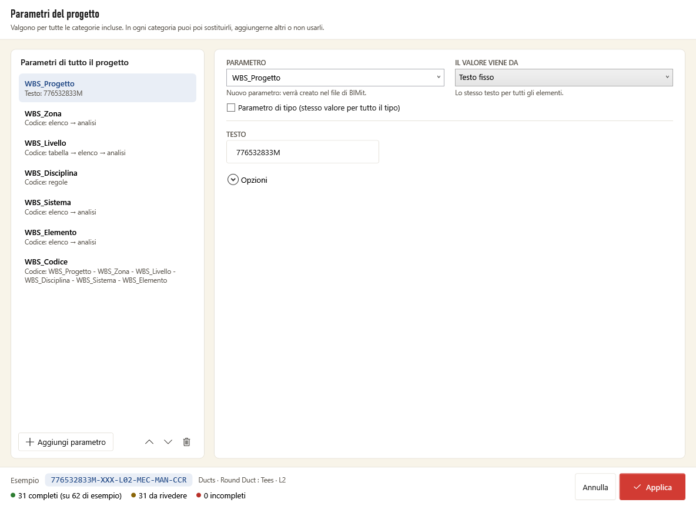

### Colonna di sinistra: i parametri da compilare

| Elemento | Cosa fa |
|---|---|
| **Elenco** | Un parametro per riga, con il riassunto di da dove viene il valore. In una categoria: *dal progetto*, *modificato qui* o *solo qui*. |
| **Aggiungi parametro** | Aggiunge un parametro nuovo. |
| **↑ ↓** | Cambiano l'ordine. |
| **🗑** | Nel progetto: toglie il parametro. In una categoria: *non usarlo qui* (le altre categorie lo usano ancora). |
| **Non usati qui · Riusa** | Solo in una categoria: i parametri del progetto che hai tolto; **Riusa** li rimette. |

### A destra: il parametro scelto

| Elemento | Cosa fa |
|---|---|
| **Banner giallo** | In una categoria: *Modificato in questa categoria* o *Parametro usato solo in questa categoria*. **Ripristina dal progetto** annulla le modifiche e torna alla versione del progetto. |
| **PARAMETRO** | Il nome del parametro da compilare: dal file dei parametri condivisi, dai parametri già nel progetto, oppure scrivi un nome nuovo (lo crea BIMit). |
| **IL VALORE VIENE DA** | La fonte del valore (sotto). |
| **Parametro di tipo** | Spuntato: un valore uguale per tutti gli elementi dello stesso tipo. Non spuntato: un valore per ogni elemento (istanza). |

**Le cinque fonti del valore**

| Fonte | Cosa scrive | Cosa scegli |
|---|---|---|
| **Testo fisso** | Lo stesso testo per tutti gli elementi. | **TESTO**. |
| **Informazioni progetto** | Un campo di *Gestisci → Informazioni progetto*. | **CAMPO**: numero, nome, cliente, edificio, organizzazione, indirizzo, stato, autore (vedi accanto il valore del modello). |
| **Proprietà dell'elemento** | Il valore di una proprietà, così com'è. | **PROPRIETÀ**: nome famiglia, nome tipo, descrizione, livello, sistema, commenti, contrassegno, workset, fase… oppure **Altro parametro…** e scrivi il nome di un parametro qualsiasi. |
| **Codice (regole, tabella, analisi)** | Un codice scelto da un elenco con regole, tabella e analisi. | Vedi sotto. |
| **Combina parametri** | Il **codice WBS completo**, unendo gli altri parametri. | Vedi sotto. |

### La fonte «Codice»

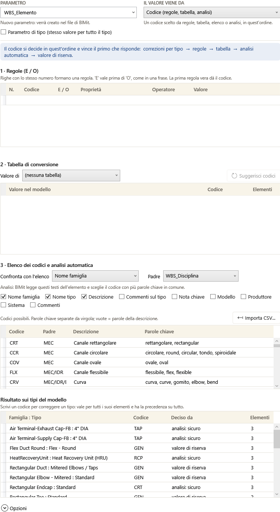

Il codice si decide in quest'ordine e **vince il primo che risponde**:
**correzioni per tipo → regole → tabella → elenco e analisi → valore di riserva**.

**1 · Regole (E / O)** — condizioni scritte da te.

| Colonna | Significato |
|---|---|
| **N.** | Il numero della regola: le righe con lo stesso numero formano **una** regola. |
| **Codice** | Il codice che la regola assegna (sulla prima riga della regola). |
| **E / O** | Come la riga si lega alla precedente. *E* vale prima di *O*, come in una frase. |
| **Proprietà** | Cosa leggere sull'elemento (categoria, nome famiglia, classificazione del sistema…). |
| **Operatore** | *contiene, uguale a, inizia con, finisce con, non contiene, diverso da, è vuoto, non è vuoto*. |
| **Valore** | Il testo da confrontare (maiuscole e accenti non contano). |

Sotto la tabella BIMit rilegge ogni regola in italiano (*Regola 1: se … → ANT*): controlla lì che
dica quello che intendi. Aggiungi una riga scrivendo nell'ultima riga vuota; per toglierla clicca il
bordino a sinistra della riga e premi **Canc** (vale per tutte le tabelle di questa finestra).

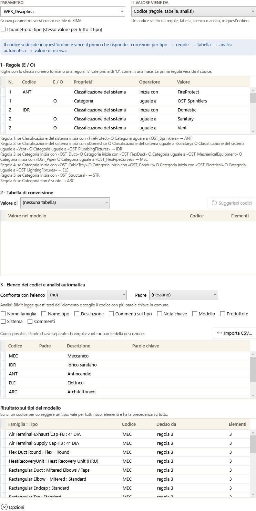

**2 · Tabella di conversione** — valore del modello → codice.

| Elemento | Cosa fa |
|---|---|
| **Valore di** | La proprietà da convertire (per esempio *Livello*). *(nessuna tabella)* = non usata. |
| **Valore nel modello** | I valori trovati negli elementi, con quanti elementi hanno quel valore (**Elementi**). |
| **Codice** | Scrivi il codice per ogni valore. |
| **Suggerisci codici** | Propone un codice per i valori senza codice (per i livelli: *Piano terra* → L00, *L2* → L02, *Copertura* → L99…). Controllali. |

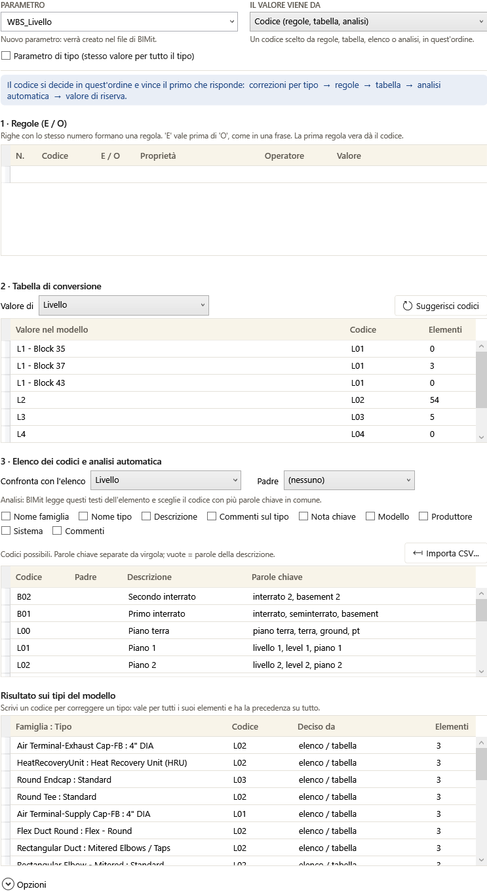

**3 · Elenco dei codici e analisi automatica** — i codici possibili e come riconoscerli.

| Elemento | Cosa fa |
|---|---|
| **Confronta con l'elenco** | Se il valore di questa proprietà è uguale a un codice o a una descrizione dell'elenco, vale quel codice. *(no)* = non confrontare. |
| **Padre** | Il codice si sceglie solo tra le righe del codice padre deciso per lo stesso elemento (per esempio l'*Elemento* tra quelli della *Disciplina*). |
| **Caselle dell'analisi** | I testi dell'elemento che BIMit legge (nome famiglia, nome tipo, descrizione, commenti, sistema…). Sceglie il codice con più **parole chiave** in comune. |
| **Importa CSV…** | Carica i codici da un file `.csv` o `.xlsx` con le colonne *codice; descrizione; parole chiave*. Chiede se sostituire o aggiungere. |
| **Tabella dei codici** | **Codice**, **Padre** (uno o più, separati da `/`), **Descrizione**, **Parole chiave** separate da virgola (vuote = le parole della descrizione). |

**Risultato sui tipi del modello** — l'esito per ogni *Famiglia : Tipo*.

| Colonna | Significato |
|---|---|
| **Famiglia : Tipo**, **Elementi** | Il tipo e quanti elementi ha. |
| **Codice** | Il codice deciso. **Scrivine uno per correggere il tipo**: vale per tutti i suoi elementi e vince su tutto il resto. |
| **Deciso da** | *regola N*, *elenco / tabella*, *analisi: sicuro*, *analisi: incerto, da rivedere*, *valore di riserva*, *deciso da te*, *nessun metodo ha risposto*… |

### La fonte «Combina parametri»

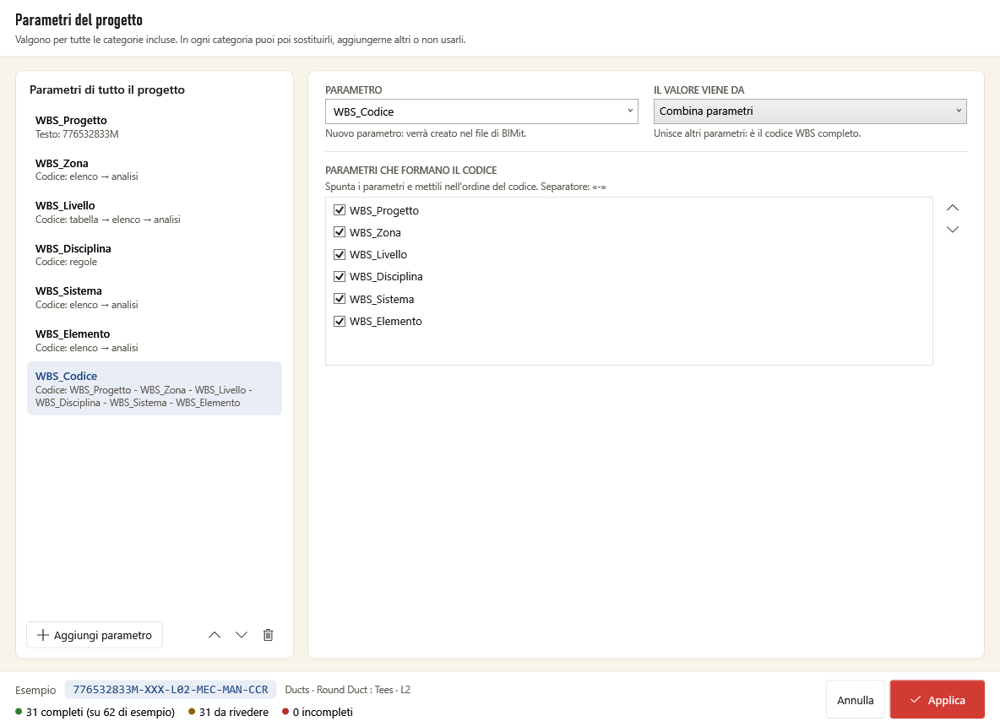

Spunta i parametri che formano il codice e mettili in ordine con **↑ ↓**. Il separatore è indicato
sopra l'elenco. Ci può essere un solo parametro *Combina parametri*.

### Opzioni

| Opzione | Cosa fa |
|---|---|
| **Obbligatorio** | Se il valore manca l'elemento resta *incompleto* (non viene scritto). Togli la spunta per i parametri facoltativi. |
| **Valore di riserva** | Il codice da usare quando nulla decide. L'elemento va in *da rivedere*. |

### Piede della finestra

| Elemento | Cosa fa |
|---|---|
| **Esempio** | Il codice di un elemento vero del modello, calcolato mentre modifichi. |
| **completi / da rivedere / incompleti** | I conteggi (nel progetto, su un campione di elementi). |
| **Problema più frequente** | In rosso: cosa blocca più elementi. |
| **Annulla** | Chiude senza applicare (chiede conferma se hai cambiato qualcosa). |
| **Applica** | Applica le modifiche alla configurazione (poi ricordati di **Salva**). Se c'è un errore te lo dice; gli avvisi puoi accettarli. |

Una categoria parte dai parametri del progetto:

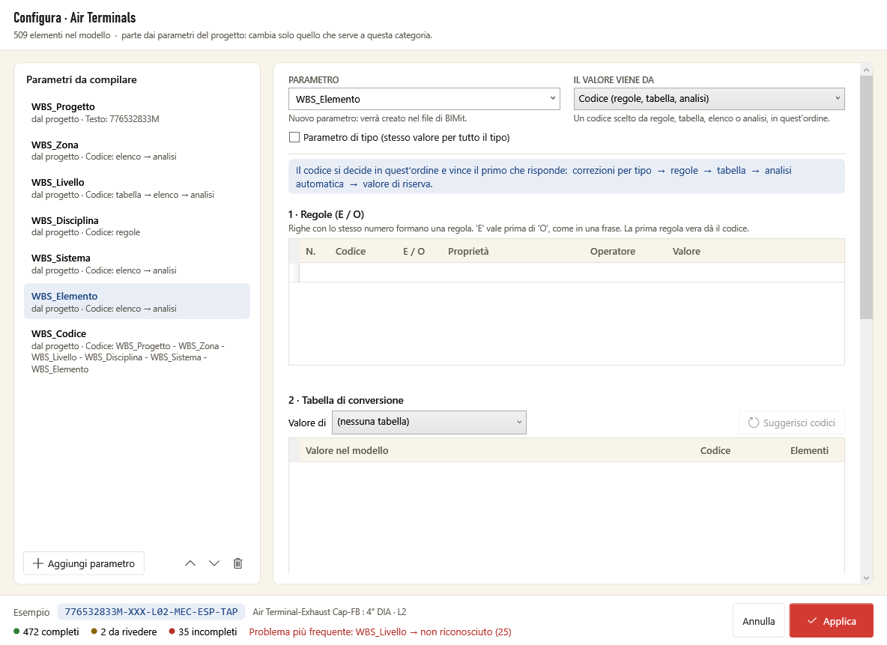

---

## 7. Gli stati: completo, da rivedere, incompleto

| Stato | Significato | Si scrive? |
|---|---|---|
| **completo** | Tutti i parametri hanno un valore deciso. | Sì |
| **da rivedere** | Il codice c'è, ma viene dal *valore di riserva* o da un'analisi incerta. Controllalo. | Sì |
| **incompleto** | Manca un valore obbligatorio o un valore non è valido. | No |
| **Esclusa** | La categoria non è inclusa nella WBS. | No |

Problemi che rendono un elemento *incompleto*:

| Problema | Cosa fare |
|---|---|
| **valore mancante** | La proprietà o il campo letto è vuoto nel modello: compilalo in Revit o cambia la fonte. |
| **valore non in tabella** | Aggiungi il valore alla *Tabella di conversione*. |
| **non riconosciuto** | Nessun metodo ha trovato il codice: aggiungi una regola, una parola chiave o una correzione per tipo. |
| **più codici possibili** | L'analisi è in pari merito: aggiungi parole chiave più precise o una regola. |
| **contiene il separatore** | Il valore contiene il separatore del codice (es. `-`): usa un altro valore o un testo fisso. |

---

## 8. Anteprima

Il codice di ogni elemento, da dove viene ogni parte, cosa correggere. Si apre dalla finestra WBS
o dalla scheda BIMit (*Shift + clic*: solo la vista attiva).

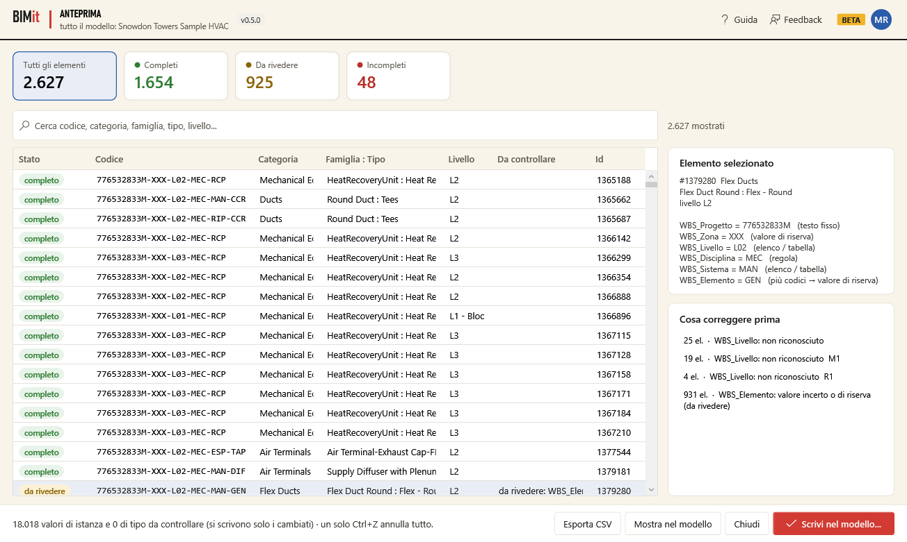

| Elemento | Cosa fa |
|---|---|
| **Carte in alto** | *Tutti gli elementi*, *Completi*, *Da rivedere*, *Incompleti*: clicca una carta per filtrare la tabella. |
| **Cerca** | Filtra per codice, categoria, famiglia, tipo, livello… |
| **Tabella** | *Stato*, *Codice*, *Categoria*, *Famiglia : Tipo*, *Livello*, *Da controllare* (i problemi), *Id*. Clicca un'intestazione per ordinare. |
| **Elemento selezionato** | Per la riga scelta: ogni parametro con il suo valore e **da dove viene** (*testo fisso*, *regola*, *elenco / tabella*, *analisi (sicuro)*, *analisi (incerto)*, *valore di riserva*, *deciso da te*, *non riuscito*…) e i problemi (✖). |
| **Cosa correggere prima** | I problemi ordinati per numero di elementi: parti dal primo. |
| **Esporta CSV** | Salva tutte le righe in un CSV da aprire in Excel. |
| **Mostra nel modello** | Chiude e seleziona in Revit gli elementi scelti (più righe con Ctrl o Shift). Se non ne scegli nessuno, seleziona tutti quelli mostrati dal filtro. |
| **Chiudi** | Chiude. |
| **Scrivi nel modello…** | Va al [riepilogo prima di scrivere](#9-scrivi-nel-modello). |

---

## 9. Scrivi nel modello

Il riepilogo prima di toccare il modello.

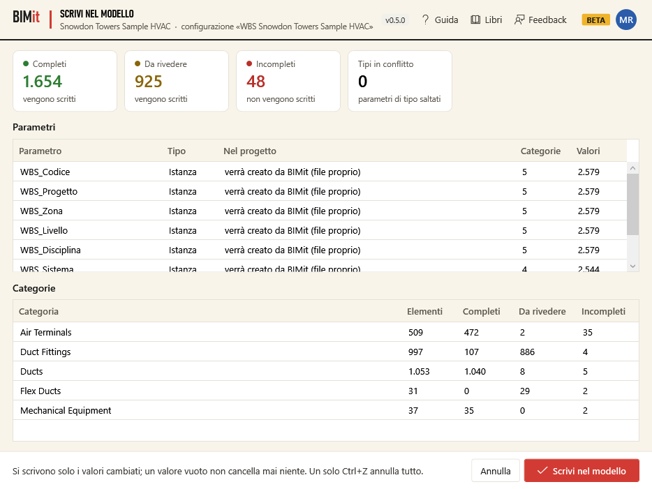

| Elemento | Cosa dice |
|---|---|
| **Completi / Da rivedere / Incompleti** | Quanti elementi e se vengono scritti (gli incompleti no). |
| **Tipi in conflitto** | Tipi i cui elementi avrebbero valori diversi per un parametro di tipo: quei parametri di tipo non vengono scritti. |
| **Parametri** | Per ogni parametro: *Istanza* o *Tipo*, e **nel progetto**: *esiste già*, *verrà creato dal file dei parametri condivisi*, *verrà creato da BIMit (file proprio)*, oppure *esiste come parametro di tipo/istanza: non verrà scritto*. Poi in quante categorie e quanti valori. |
| **Categorie** | Per ogni categoria: elementi, completi, da rivedere, incompleti. |
| **Annulla** | Torna indietro senza scrivere. |
| **Scrivi nel modello** | Crea i parametri che mancano e scrive i valori. |

**Regole di sicurezza:** si scrivono solo i valori cambiati; un valore vuoto non cancella mai
niente; tutto avviene in un'unica operazione, quindi **un solo Ctrl+Z in Revit annulla tutto**.

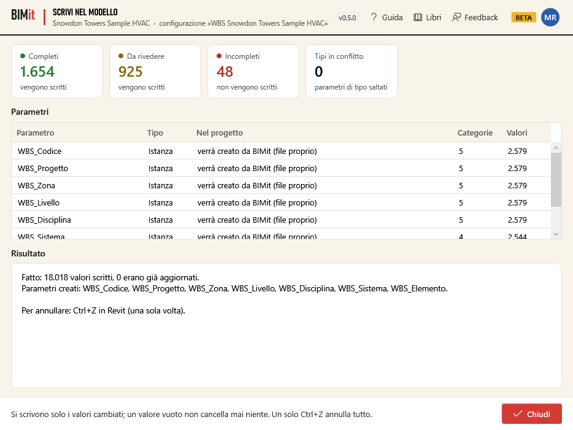

Il **Risultato** dice quanti valori sono stati scritti, quanti erano già aggiornati, quali
parametri sono stati creati e, se qualcosa non è stato scritto, perché.

---

## 10. Il dizionario Excel

Il modo più semplice per usare **i codici del committente**: scarichi la WBS in un foglio Excel, lo
compili (a mano, copiando la tabella del committente, o con un assistente IA) e lo ricarichi.

1. **Scarica dizionario…** nella finestra WBS: salva `<modello>_dizionario_WBS.xlsx` e propone di aprirlo.
2. Il foglio ha **un blocco per ogni parametro**, affiancati. In testa: il **Separatore** e un
   **Esempio** del codice, calcolato dal foglio mentre scrivi.
3. In ogni blocco, le righe di impostazione:

   | Riga | Cosa scrivere |
   |---|---|
   | **Parametro** | Il nome del parametro in Revit (es. `WBS_Disciplina`). |
   | **Cifre** | Quanti caratteri ha il codice. |
   | **Padre** | Il parametro padre (es. l'*Elemento* dipende dalla *Disciplina*), o vuoto. |
   | **Leggi da** | Cosa leggere sull'elemento: dal menu (*Livello*, *Categoria, Sistema*, *Nome famiglia, Nome tipo, Descrizione*, *Workset*, *Informazioni progetto: …*, *Testo fisso*, *Parametro: nome del parametro*, *Regole in BIMit*…). |
   | **Se non trovato** | Il codice di riserva. |
   | **Nel codice** | *Sì* se fa parte del codice completo. |

4. Sotto, una riga per codice: **Codice padre** · **Descrizione** · **Description (EN)** · **Codice** ·
   **Parole chiave** (separate da virgola).
5. **Carica dizionario…**: BIMit controlla il foglio.
   - Con **errori** non cambia niente e te li elenca (es. *Cifre deve essere un numero*).
   - Gli **avvisi** non bloccano: li vedi nel riepilogo (parametri, codici, categorie) e scegli se aggiornare.
   - Le regole e le correzioni per tipo già fatte in BIMit **restano**. Finché non premi *Salva* puoi
     ancora tornare indietro.

---

## 11. Esporta tavole e viste

Tavole e viste in **PDF, DWG, NWC e IFC** in un colpo solo, con gli esportatori di Revit: niente
stampante PDF, niente AutoCAD. Si apre con il pulsante **Esporta** della scheda BIMit.

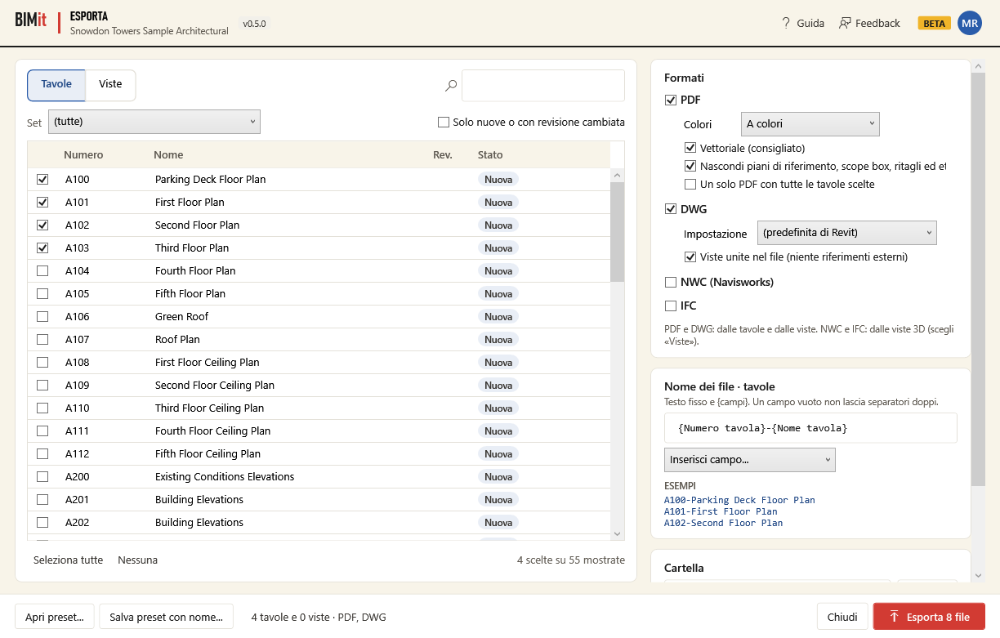

### A sinistra: cosa esportare

| Elemento | Cosa fa |
|---|---|
| **Tavole · Viste** | L'elenco delle tavole o delle viste (3D, piante, sezioni, prospetti, legende…). Puoi sceglierne da entrambi gli elenchi nella stessa esportazione. |
| **🔍 casella di ricerca** | Filtra per numero o nome. |
| **Set** | Mostra solo le tavole di un set di stampa del progetto. |
| **Solo nuove o con revisione cambiata** | Nasconde quelle già esportate con la stessa revisione: dopo una nuova revisione trovi subito cosa riconsegnare. |
| **Casella a sinistra di ogni riga** | Sceglie la tavola. Con più righe evidenziate (Ctrl o Shift), **Spazio** le spunta tutte. |
| **Stato** | *Nuova* (mai esportata), *Revisione cambiata*, *Esportata il …*. |
| **Seleziona tutte · Nessuna** | Spunta o toglie tutte quelle mostrate. |

### A destra: come esportare

**Formati**

| Formato | Opzioni |
|---|---|
| **PDF** | *Colori* (a colori, scala di grigi, bianco e nero); *Vettoriale* (consigliato: linee nitide, file leggeri); *Nascondi piani di riferimento, scope box, ritagli ed etichette non usate*; *Un solo PDF con tutte le tavole scelte*, con il suo nome. Il formato del foglio è quello di ogni tavola. |
| **DWG** | *Impostazione*: le impostazioni di esportazione DWG del progetto (layer, colori, unità); *Viste unite nel file*: un solo DWG per tavola, senza riferimenti esterni; *Elimina i file .pcp* che Revit scrive accanto a ogni DWG. |
| **NWC** | Dalle **viste 3D**: *Coordinate condivise*, *Dividi per livelli*, *ID degli elementi*, *Includi i modelli collegati*. Serve l'esportatore Navisworks per Revit (se manca, BIMit lo dice). |
| **IFC** | Dalle **viste 3D**: *Versione* (IFC 2x3 CV 2.0, IFC4 Reference View, IFC4 Design Transfer View), *Solo gli elementi visibili nella vista*, *Proprietà comuni IFC*, *Proprietà di Revit*, *Quantità di base*, *Coordinate condivise*. |

**Nome dei file** — testo fisso e **{campi}**, uno schema per le tavole e uno per le viste.
*Inserisci campo…* aggiunge un campo dove si trova il cursore: *Numero tavola*, *Nome tavola*,
*Revisione*, *Data revisione*, *Nome vista*, *Numero progetto*, *Nome progetto*, *Nome cliente*,
*Data di oggi*… oppure *Parametro…* per qualsiasi parametro della tavola (o delle informazioni
progetto), per esempio `{Parametro: Codice elaborato}`. Sotto, **Esempi** mostra i nomi veri. Un campo
vuoto non lascia separatori doppi e i caratteri non ammessi da Windows vengono tolti.

**Cartella**

| Opzione | Cosa fa |
|---|---|
| **Cartella · Sfoglia…** | Dove salvare. |
| **Una sottocartella per formato** | PDF, DWG, NWC, IFC in cartelle separate. |
| **Aggiorna l'elenco elaborati (Excel)** | Scrive *Elenco elaborati.xlsx* nella cartella: numero, titolo, revisione, data revisione, file PDF/DWG/NWC/IFC e data di esportazione di tutto quello esportato con questo preset. |
| **Apri la cartella alla fine** | Apre la cartella quando ha finito. |

### In basso

| Elemento | Cosa fa |
|---|---|
| **Apri preset… · Salva preset con nome…** | Le impostazioni (formati, nomi, cartella) e lo storico delle esportazioni sono un file `.json`: salvalo nella cartella del progetto e i colleghi lo aprono con *Apri preset…*. BIMit lo collega al modello e lo salva da solo. |
| **Barra di avanzamento** | Il file in corso (*PDF 3/20 · A101-…*). |
| **Esporta N file** | Parte. Durante l'esportazione diventa **Interrompi**: si ferma dopo il file in corso. |
| **Chiudi** | Chiude e ricorda le impostazioni. |

Alla fine BIMit apre la cartella; se qualche file non è riuscito ti dice quale e perché.

---

## 12. Account, Feedback, Aggiornamento

### Account

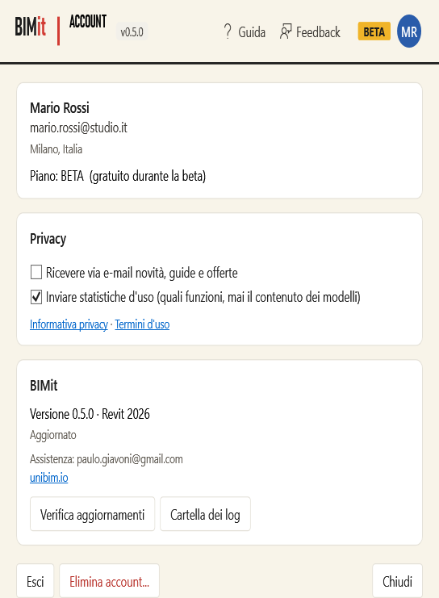

| Elemento | Cosa fa |
|---|---|
| **Nome, e-mail, città, piano** | I dati del tuo profilo. |
| **Ricevere via e-mail novità, guide e offerte** | Il consenso al marketing: lo dai o lo togli qui. |
| **Inviare statistiche d'uso** | Quali funzioni usi (mai il contenuto dei modelli). Toglila per non inviarle. |
| **Informativa privacy · Termini d'uso** | Aprono i testi. |
| **Versione · Revit** | Versione di BIMit e di Revit, e lo stato degli aggiornamenti. |
| **Verifica aggiornamenti** | Controlla adesso se c'è una nuova versione. |
| **Cartella dei log** | Apre la cartella del registro tecnico (utile all'assistenza). |
| **unibim.io** | Apre il sito. |
| **Esci** | Esce dall'account su questo PC. |
| **Elimina account…** | Cancella subito e per sempre account, profilo, statistiche e messaggi. Chiede conferma. |
| **Chiudi** | Chiude. |

### Feedback

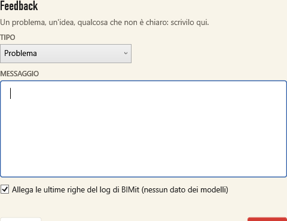

Scegli il **TIPO** (*Problema*, *Idea*, *Domanda*, *Altro*), scrivi il **MESSAGGIO** e premi **Invia**.
**Allega le ultime righe del log** aiuta a capire un errore: contiene solo dati tecnici di BIMit,
mai dei modelli.

### Aggiornamento

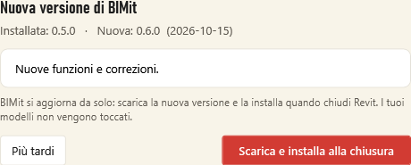

| Pulsante | Cosa fa |
|---|---|
| **Scarica e installa alla chiusura** | Di solito non serve: BIMit lo fa da solo all'avvio. Scarica la nuova versione, ne verifica l'integrità e la installa quando chiudi Revit. I modelli non vengono toccati. Se è già scaricata, la finestra lo dice. |
| **Più tardi** | Chiude. Se l'aggiornamento è già scaricato (*Aggiornamento pronto*) si installa comunque quando chiudi Revit; altrimenti BIMit riprova da solo al prossimo avvio. |

---

## 13. Domande frequenti

**Anteprima e Scrivi sono grigi.** Nessuna categoria inclusa, oppure la configurazione ha un errore:
leggi il messaggio in basso nella finestra WBS (passa il mouse per vederli tutti).

**Tutti gli elementi sono incompleti.** Apri l'*Anteprima* e guarda *Cosa correggere prima*: di
solito è un solo parametro (per esempio il numero di progetto vuoto o con il separatore, o livelli
con nomi non riconosciuti → *Tabella di conversione* del livello, *Suggerisci codici*).

**Un parametro «esiste come parametro di tipo/istanza: non verrà scritto».** Nel progetto c'è già un
parametro con quel nome ma con l'altro legame: in *Configura* cambia la casella *Parametro di tipo*
o usa un altro nome.

**L'aggiornamento non si installa.** Si installa quando si chiude **l'ultimo** Revit aperto sul PC
(anche di un'altra versione): chiudili tutti e riapri. Se vedi ancora la versione vecchia, in
*Account* premi *Verifica aggiornamenti* e manda un *Feedback* con il log allegato.

**Ho scritto e voglio tornare indietro.** Un solo **Ctrl+Z** in Revit annulla tutta la scrittura.

**Come passo la configurazione a un collega?** *Salva con nome…* e mandagli il file `.json`: lui lo
apre con *Apri…*.

**Il PDF o il DWG non si crea.** Il file con lo stesso nome è aperto (in un lettore PDF o in
AutoCAD): chiudilo e riprova. Il messaggio finale dice quale file non è riuscito.

**Il modello è di sola lettura.** BIMit mostra l'anteprima ma non scrive: apri il modello in
modifica (o crea il locale, se è condiviso).

**Assistenza** — pulsante **Feedback** in ogni finestra, oppure paulo.giavoni@gmail.com.

[Informativa privacy](PRIVACY.md) · [Termini d'uso](TERMS.md) · [Installazione](README.md)
